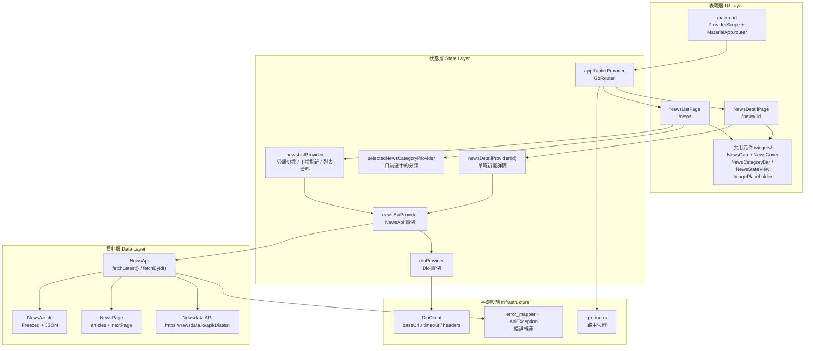

# flutter_news_riverpod_start

Flutter 新聞練習專案，使用 `Riverpod`、`go_router`、`Dio`、`Freezed` 與 `json_serializable` 建立一個可切換分類、瀏覽列表與查看詳情的新聞 App。

## 專案技術架構圖



## 資料流

1. 使用者從 `NewsListPage` 進入 App。
2. `appRouterProvider` 負責導向 `/news` 與 `/news/:id`。
3. `newsListProvider` 讀取新聞列表，並支援分類切換與下拉刷新。
4. `newsDetailProvider(id)` 依照路由參數抓取單篇文章。
5. `NewsApi` 透過 `Dio` 呼叫 Newsdata API，並把 JSON 轉成 `NewsArticle` / `NewsPage`。
6. UI 層使用 `NewsCard`、`NewsCover`、`NewsCategoryBar`、`NewsStateView` 與 `ImagePlaceholder` 呈現內容與狀態。

## 專案分層對照

| 層級 | 主要路徑 | 職責 |
| --- | --- | --- |
| 表現層 | `lib/main.dart`、`lib/features/news/pages/`、`lib/features/news/widgets/` | App 入口、頁面、共用 UI 元件 |
| 狀態層 | `lib/core/router/`、`lib/core/providers/`、`lib/features/news/providers/` | 路由、資料狀態、刷新與分類切換 |
| 資料層 | `lib/features/news/api/`、`lib/features/news/models/` | API 存取、JSON 解析、資料模型 |
| 基礎設施層 | `lib/core/network/` | `Dio` 建立、錯誤轉譯、網路設定 |

## 主要模組

| 模組 | 檔案 | 說明 |
| --- | --- | --- |
| App 入口 | `lib/main.dart` | 建立 `ProviderScope` 與 `MaterialApp.router` |
| 路由 | `lib/core/router/app_router.dart` | 定義 `/news` 與 `/news/:id` |
| 列表頁 | `lib/features/news/pages/news_list_page.dart` | 顯示分類、列表、載入與錯誤狀態 |
| 詳情頁 | `lib/features/news/pages/news_detail_page.dart` | 顯示文章內容、圖片與原文連結 |
| 列表狀態 | `lib/features/news/providers/news_list_provider.dart` | 管理分類、刷新與列表請求 |
| 詳情狀態 | `lib/features/news/providers/news_detail_provider.dart` | 依 `id` 載入單篇文章 |
| API | `lib/features/news/api/news_api.dart` | 封裝 Newsdata API 請求與資料清洗 |
| 模型 | `lib/features/news/models/` | `NewsArticle`、`NewsPage` 等資料結構 |
| 網路核心 | `lib/core/network/` | `DioClient`、`ApiException`、錯誤映射 |

## 套件用途與原因

| 套件 | 在這個專案做什麼 | 為什麼需要 |
| --- | --- | --- |
| `flutter_riverpod` | 管理 App 狀態、頁面資料流、依賴注入 | 讓 UI 和資料邏輯分離，避免把 API 呼叫寫進 widget |
| `riverpod_annotation` / `riverpod_generator` | 產生 `@Riverpod` / `@riverpod` 對應的 provider 程式碼 | 減少樣板碼，讓 provider 定義更簡潔、可維護 |
| `go_router` | 處理 `/news` 與 `/news/:id` 頁面切換 | 路由宣告清楚，並且可直接從 URL 取得文章 id |
| `dio` | 發送 HTTP 請求到 Newsdata API | 比原生 `http` 更容易管理 timeout、headers、query parameters |
| `freezed_annotation` / `freezed` | 定義不可變資料模型，產生 `copyWith`、`==`、`hashCode` 等能力 | 讓 `NewsArticle` 這類資料物件更安全，避免狀態被意外修改 |
| `json_annotation` / `json_serializable` | 自動生成 JSON 轉物件、物件轉 JSON 的程式碼 | 讓 API 回傳資料能穩定映射成模型，減少手寫 `fromJson` 錯誤 |
| `url_launcher` | 開啟新聞原文連結 | 讓詳情頁可以跳轉到外部網站閱讀完整文章 |
| `build_runner` | 執行程式碼生成 | 用來產生 Riverpod、Freezed、JSON 的 `.g.dart` / `.freezed.dart` 檔案 |
| `flutter_lints` | 提供 Flutter/Dart 靜態檢查規則 | 幫助維持一致的程式風格，提早抓出潛在問題 |

### 補充說明

- `Freezed` 不只是轉 JSON，它主要是在做「資料模型的結構化與不可變化」。
- `json_serializable` 才是負責 `JSON <-> 物件` 的轉換。
- 這個專案把兩個一起用，是因為新聞資料需要：
  - 穩定的資料結構
  - 自動化的 JSON 映射
  - 乾淨的模型定義
- `Riverpod` 則負責把 API、列表狀態、分類切換、詳情載入串成一致的資料流。

## 外部服務

| 服務 | 用途 |
| --- | --- |
| Newsdata API | 取得最新新聞列表與單篇新聞詳情 |

## 目錄結構

```text
lib/
├── main.dart
├── core/
│   ├── network/
│   ├── providers/
│   └── router/
└── features/
    └── news/
        ├── api/
        ├── models/
        ├── pages/
        ├── providers/
        └── widgets/
```

## 註記

- `NewsListPage` 與 `NewsDetailPage` 都是以 Riverpod 為中心組織資料流。
- `NewsApi` 負責把外部 JSON 轉成可供 UI 使用的資料模型。
- `ImagePlaceholder` 用在圖片載入中，讓詳情頁的 loading 狀態更平滑。

## 下載與執行

### 1. 下載專案

```bash
git clone https://github.com/alan1231/news_riverpod.git
cd news_riverpod
```

### 2. 安裝相依套件

```bash
flutter pub get
```

### 3. 如果需要重新產生程式碼

當你修改了 `Riverpod`、`Freezed` 或 `json_serializable` 相關檔案時，可以重新產生生成碼：

```bash
flutter pub run build_runner build --delete-conflicting-outputs
```

### 4. 執行專案

```bash
flutter run
```

### 5. API Key 補充

這個專案預設已經內建一組示範用的 Newsdata API key，所以一般情況下下載後就能直接執行。
如果你要改成自己的 key，也可以在執行時指定 `NEWSDATA_API_KEY`。

## APK 下載

如果你想直接安裝 Android 版本，可以使用我打包好的 APK。

### 下載位置

- GitHub Releases：`https://github.com/alan1231/news_riverpod/releases`
- 本機打包輸出：`build/app/outputs/flutter-apk/app-release.apk`

### 安裝方式

1. 下載 `app-release.apk`
2. 把 APK 傳到 Android 裝置
3. 開啟檔案並安裝
4. 如果系統阻擋未知來源安裝，先到系統設定允許安裝

### 重新打包

如果你要自己重新產生 APK：

```bash
flutter build apk --release
```
